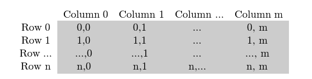
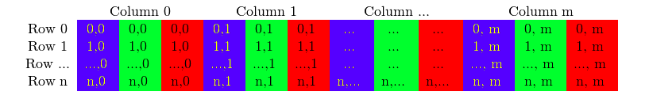

# OpenCV Lab

## Introduction
OpenCV is a library of programming functions mainly aimed at real-time computer vision. This one of most widely used computer vision lib.

Main Modules:
| Module  |
|---|
| Core  |
| imgproc  |
| imgcodecs  |
| videoio   |
| highgui   |
| video   |
| calib3d  |
| features2d  |
| objdetect  |
| dnn  |
| ml  |
| flann   |
| photo  |
| stitching   |
| gapi |


## Core 
### Mat Data type
<b>Mat</b> is basically a class with two data parts: <b>the matrix header</b> (containing information such as the size of the matrix, the method used for storing, at which address is the matrix stored, and so on) and <b>a pointer to the matrix</b> containing the pixel values (taking any dimensionality depending on the method chosen for storing).

```c++
cv::Mat img = cv::imread("test.png", cv::IMREAD_COLOR)
cv::Mat new_img = img;
```
The assign operator only copies the matrix header.

<b>APIS</b>:

<b>cv::Mat::clone()</b> - Creates a full copy of the array and the underlying data.

<b>cv::Mat::copyTo</b>  - Copies the matrix to another one. 

The major difference between these two API's is that, When the destination matrix and the source matrix have the same type and size, copyTo will not change the address of the destination matrix, while clone will always allocate a new address for the destination matrix.

```c++
cv::Mat img = cv::imread("test.png", cv::IMREAD_COLOR)
cv::Mat new_img = img.clone();
```

### Color Space
RGB is the most common as our eyes use something similar, however keep in mind that <b>OpenCV standard display system composes colors using the BGR color space</b> (red and blue channels are swapped places).

### Measure a operation time
```c++
double time = (double)cv::getTickCount();
//do something
time = ((double)cv::getTickCount() - time)/cv::getTickFrequency();
std::cout << "Time: " << time << std::endl;
```

### Image matrix stored in Memory
#### Gray Scale


#### BGR


<b> Intersting one </b> :smiley:

If the memory allcoated for Matrix is Continuous then there is a efficent way to access them.

```c++
Mat& ScanImageAndReduceC(Mat& img, const uchar* const table)
{
    // accept only char type matrices
    CV_Assert(img.depth() == CV_8U);
    int channels = img.channels();
    int nRows = img.rows;
    int nCols = img.cols * channels;
    if (img.isContinuous())
    {
        nCols *= nRows;
        nRows = 1;
    }
    int i,j;
    for( i = 0; i < nRows; ++i)
    {
        for ( j = 0; j < nCols; ++j)
        {
            //do something
        }
    }
    return I;
}
```

